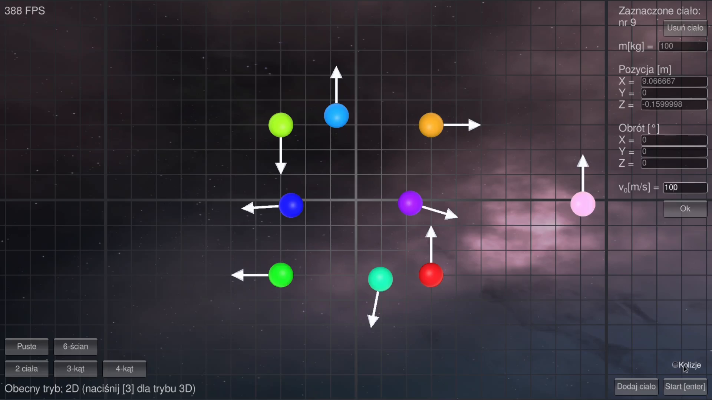
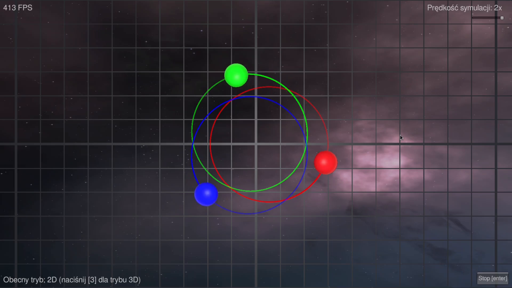
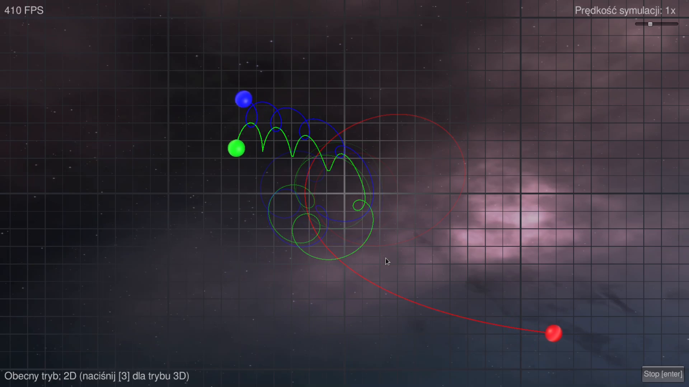
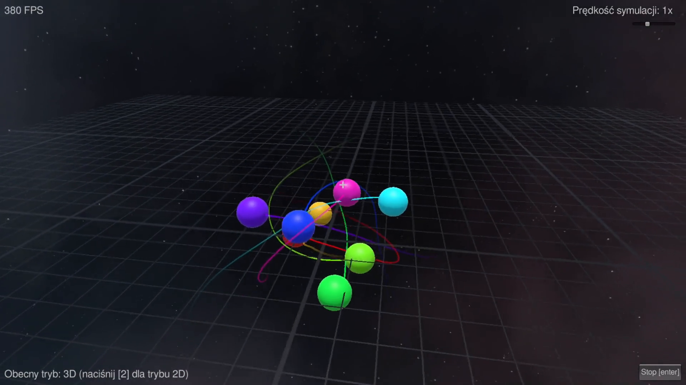
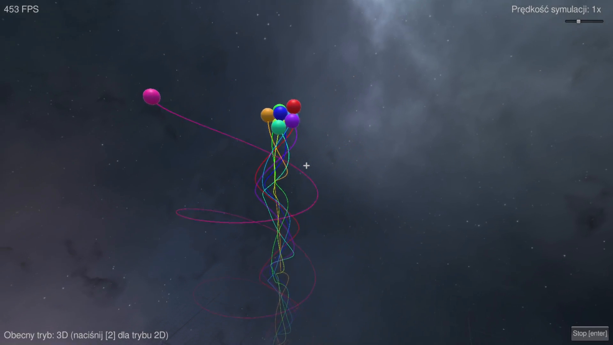

# 🪐 Symulacja N Ciał w Unity

Konfigurowalna, działająca w czasie rzeczywistym symulacja grawitacyjnych interakcji między ciałami niebieskimi, stworzona w Unity przy użyciu C#. Opiera się na prawie powszechnego ciążenia Newtona i obsługuje dowolną liczbę ciał, z możliwością dostosowania parametrów początkowych oraz wizualizacją trajektorii.

## 🚀 Funkcje

- 🔢 **Symulacja N ciał** – bez ograniczenia do trzech ciał.
- ⚖️ **Prawo powszechnego ciążenia** – obliczenia oparte na prawie Newtona.
- 🎮 **Interaktywność i wizualizacja** – symulacja w czasie rzeczywistym z rysowaną trajektorią.
- 🛠️ **Dostosowywane parametry**:
  - Pozycje i prędkości początkowe
  - Masy ciał
  - Prędkość symulacji
- 🎛️ **Kilka gotowych konfiguracji do wczytania** – np. trójkąt, kwadrat lub sześcian
- ⭕ **Kolizje ciał** – ustawienie, aby ciała nie przenikały przez siebie

## 🎥 Podgląd

<details>
<summary>Zrzuty ekranu z programu</summary>









</details>

## 🧠 Jak to działa?

Każdy obiekt w scenie traktowany jest jako ciało niebieskie z masą. W każdej klatce symulacji obliczana jest siła grawitacji między wszystkimi parami ciał zgodnie z prawem Newtona:

```
F = G * (m₁ * m₂) / r²
```

Gdzie:
- `F` to siła grawitacji
- `G` to stała grawitacyjna (zwiększona 10⁸ razy)
- `m₁` i `m₂` to masy ciał
- `r` to odległość między nimi

Na tej podstawie aktualizowane są prędkości i pozycje obiektów z wykorzystaniem prostych metod numerycznych.

## 🧩 Technologie

- **Unity** (wersja 6000.0.41f1)
- **C#**
- Silnik fizyki Unity wykorzystywany tylko do wyświetlania – logika grawitacji jest zaimplementowana ręcznie.

## 📝 Jak uruchomić?

### 💾 Opcja 1: Uruchomienie gotowego builda (Windows, Linux)

1. Wejdź w zakładkę **[Releases](https://github.com/Ania54/Problem-trzech-cial/releases)** na GitHubie.

2. Pobierz najnowszą wersję dla swojego systemu operacyjnego.

3. Wypakuj plik i uruchom – kliknij dwukrotnie `Problem trzech ciał.exe` (Windows) lub `Problem Trzech Ciał.x86_64` (Linux).

Nie wymaga instalacji Unity ani dodatkowego oprogramowania.

### 🔧 Opcja 2: Uruchomienie w Unity (Windows, Mac, Linux)

1. Pobierz i zainstaluj [Unity](https://unity.com/download) (wersja 6000.0.41f1).

2. Sklonuj repozytorium:
   ```bash
   git clone https://github.com/Ania54/Problem-trzech-cial.git
   ```

3. Otwórz projekt w Unity.

4. Uruchom scenę.

## 🛠 Dostosowywanie

Wszystkie parametry ciał można edytować:
- Pozycja
- Prędkość początkowa
- Masa